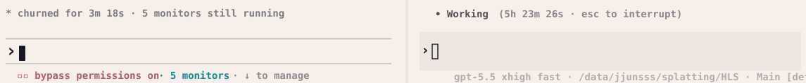
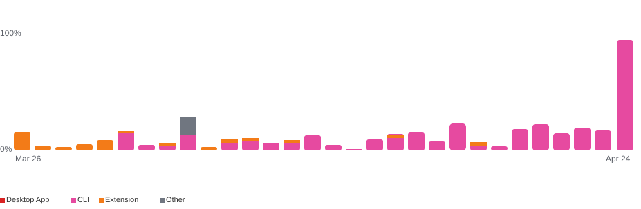

<p align="center">
  
</p>

# LOOP-STATION

**A live multi-agent loop where executors and reviewers take turns, exchange evidence, and keep improving over many sessions.**

LOOP-STATION is a protocol skill for long-running agent work. It keeps Codex,
Claude Code, and other agents coordinated when a task needs repeated execution,
review, decisions, summaries, and next-session planning.

⭐ It is useful when progress depends on reading what happened, not only running
a preset sweep. Agents inspect code changes, logs, metrics, images, trends, and
reviews, then decide what to try next.

## Install

### Codex

Ask Codex:

```text
Install the Codex skill from https://github.com/jjunsss/LOOP-STATION as loop-station.
```

Restart Codex after installation.

### Claude Code

Ask Claude Code:

```text
Install LOOP-STATION from https://github.com/jjunsss/LOOP-STATION.
```

Restart Claude Code after installation.

## How The Loop Works

The loop is simple: one agent runs, another reviews, then the executor consumes
that review and plans the next session.

```text
Executor runs
=> Executor writes results and self-review
=> Reviewer waits until the session is review-ready
=> Reviewer reads artifacts and writes review
=> Executor consumes review, writes decision, updates summaries
=> Next session starts
```

Agents coordinate through `loop_station/` artifacts and status signals. Exact
flag names are preferred, but agents should also discover equivalent signals
from files, paths, statuses, and linked artifacts when names vary.

You can ask the reviewer for visual checks, metric checks, code audit,
literature/method checks, online search, or a stricter scientific review when
the project needs it.

## How to Command It

Start from Codex with one `$loop-station` command. The format is flexible; the
important part is to brief the agents clearly for your project.

English:

```text
$loop-station
Goal: what you want to improve or decide.
Budget: sessions, time, GPUs/resources, or stop condition.
Evidence: metrics, logs, images, tests, or checks that should guide decisions.
Optional: reviewer role, paths, tools, ask-before rules, summaries.
```

Korean example:

```text
$loop-station
Goal: 현재 실험의 품질을 개선하고 싶어.
Budget: 40 sessions, GPU 4개까지 사용 가능.
Evidence: PSNR/LPIPS/SSIM, 결과 이미지, 로그, 실패 케이스를 같이 봐줘.
Optional: Claude를 reviewer로 쓰고, session 완료 후에만 리뷰하게 해줘.
```

Goal, Budget, and Evidence are recommended. Add anything else that helps control
your project. Full Codex/Claude examples are here:
[`examples/quality-improvement-loop/`](examples/quality-improvement-loop/).

## Operational Scale

I used LOOP-STATION once for a 50-session research-quality improvement run. In
practice, one subject improved from roughly PSNR 24 to 29 within about 10 hours.
Codex kept running, Claude stayed in review standby through Monitor, and the run
hit my usage limit while I was sleeping. The screenshots below are from that run.

<p align="center">
  
</p>

<p align="center">
  
</p>

For long runs, keep one Monitor/background watcher per loop when possible and
reuse it across sessions. Agents also write compact summaries under
`loop_station/summaries/` so they can resume without rereading every old log.

## Notes

- LOOP-STATION is a protocol skill, not an optimizer by itself. The executor still needs project-specific commands, metrics, artifacts, and resource checks.
- Give a session budget, resource budget, and stop condition before starting a long loop.
- Understand the permission level you give the agent.
- Give clear code-change rules: source edits, variants/backups, and ask-before rules.
- You can intervene mid-loop to redirect the next axis or stop a weak direction.
