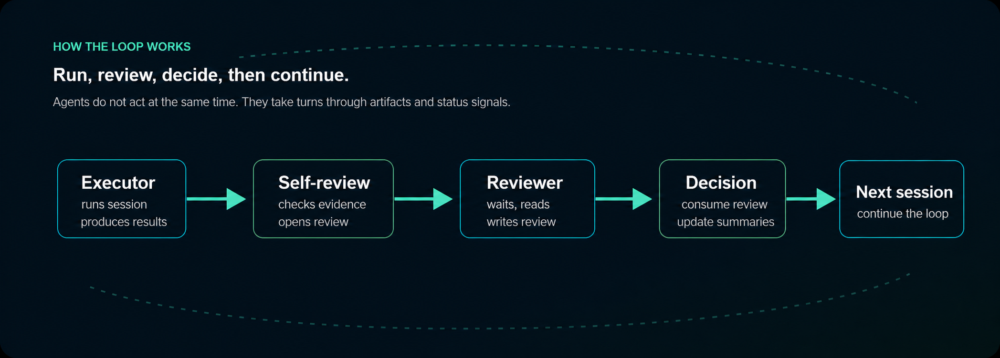

<p align="center">
  
</p>

# LOOP-STATION

**A live multi-agent loop where executors and reviewers take turns, exchange evidence, and keep improving over many sessions.**

LOOP-STATION is a protocol skill for long-running agent work. It keeps Codex,
Claude Code, and other agents coordinated when a task needs repeated execution,
review, decisions, summaries, and next-session planning.

⭐ It is useful when progress depends on reading what happened, not only running
a preset sweep. Unlike **Hydra** or **grid-search** sweeps that stay inside fixed
settings, LOOP-STATION lets agents inspect code changes, logs, metrics, images,
trends, and reviews, then actively decide what to try next.

## Install

### Codex

Ask Codex:

```text
Install the Codex skill from https://github.com/jjunsss/LOOP-STATION as loop-station.
```

Restart Codex after installation.

### Claude Code

Ask Claude Code:

```text
Install LOOP-STATION from https://github.com/jjunsss/LOOP-STATION.
```

Restart Claude Code after installation.

## How The Loop Works

The loop is simple: one agent runs, another reviews, then the executor consumes
that review and plans the next session.

<p align="center">
  
</p>

Agents communicate through files under `loop_station/`, especially
`loop_station/flags/`. Each agent leaves its current state there, waits for the
other agent's turn to finish, then continues from the written artifacts.

## How to Command It

Start from Codex with one `$loop-station` command. The format is flexible; the
important part is to brief the agents clearly for your project.

```text
$loop-station
Goal: what you want to improve or decide.
Budget: sessions, time, GPUs/resources, or stop condition.
Evidence: metrics, logs, images, tests, or checks that should guide decisions.
Optional: reviewer role, paths, tools, ask-before rules, summaries.
```

Goal, Budget, and Evidence are recommended. Add anything else that helps control
your project. English/Korean Codex and Claude examples are here:
[`examples/quality-improvement-loop/`](examples/quality-improvement-loop/).

## Operational Scale

I used LOOP-STATION once for a 50-session research-quality improvement run. In
practice, one subject improved from roughly PSNR 24 to ~ 29 within about 10 hours.
Codex kept running, Claude stayed in review standby through Monitor, and the run
used far more tokens than I normally spend with a Pro subscription. The
screenshots below are from that run.

<p align="center">
  
</p>

<p align="center">
  
</p>

## Notes

- LOOP-STATION is a protocol skill, not an optimizer by itself. The executor still needs project-specific commands, metrics, artifacts, and resource checks.
- Give a session budget, resource budget, and stop condition before starting a long loop.
- Understand the permission level you give the agent.
- Give clear code-change rules: source edits, variants/backups, and ask-before rules.
- Claude Code reviewers can stay in standby with Monitor and act when the next review turn is ready.
- You can intervene mid-loop to redirect the next axis or stop a weak direction.
