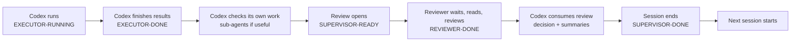

<p align="center">
  
</p>

# LOOP-STATION

**A live multi-agent loop where executors and reviewers take turns, exchange evidence, and use shared flags to coordinate timing.**

LOOP-STATION is a protocol skill, not an optimizer by itself. It keeps Codex,
Claude Code, and other agents coordinated around long experiment loops where
each session leaves reports, reviews, decisions, flags, and summaries under
`loop_station/`.

⭐ It is built for work where agents need to keep analyzing results and improve
performance over many sessions. Traditional ML automation loops often stay
inside a predeclared sweep space, such as fixed Hydra configs or parameter
grids. LOOP-STATION lets agents inspect the actual code changes, logs, metrics,
images, and trends, then plan the next intervention from what happened.

## Install

### Codex

Ask Codex:

```text
Install the Codex skill from https://github.com/jjunsss/LOOP-STATION as loop-station.
```

Restart Codex after installation.

### Claude Code

Ask Claude code:

```text
Install LOOP-STATION from https://github.com/jjunsss/LOOP-STATION.
```

Restart Claude Code after installation.

## How The Loop Works

LOOP-STATION is for live feedback loops, not one-off prompts.

The goal is not just to run many variants. The goal is to make agents understand
what changed, why the result moved, what failed, and what should be tried next.
That makes LOOP-STATION useful for ongoing optimization work where progress
depends on interpreting evidence, not only enumerating preset values.

```text
Codex runs -> Codex self-reviews -> Claude reviews -> Codex decides -> next session
```

Agents use flag files as timing signals. They work when their turn opens, hold
while waiting, and move the loop forward only after the expected result files
exist.



Simple rule: reviewers start after `EXECUTOR-DONE` + `SUPERVISOR-READY`, and
Codex starts the next session only after it has consumed `REVIEWER-DONE`, written
the decision, updated summaries, and ended the session with `SUPERVISOR-DONE`.

If a direction keeps getting worse, LOOP-STATION should not stop the whole loop.
It should go back to the best known candidate, retire the bad direction, and test
a different axis while budget remains.

Reviews can include visual image checks, metric/log analysis, code/config audit,
artifact-completeness checks, and literature-backed reasoning when useful. A
good reviewer should be willing to challenge the current direction: explain why
an intervention likely failed, what evidence supports that explanation, and what
different mechanism should be tested next. Experiments should use loop-owned
variants or copies by default so the original project state is not changed unless
the user approves it.

## How to Command It

Write the command like a short experiment brief. You do not need special protocol
words. Tell LOOP-STATION what you want, what evidence matters, how far it may
run, and who should do which part.

### Minimal Live Loop

The command can be short. It works better when the goal, metrics, visual checks,
budget, and agent roles are clear.

Useful details to include:

```text
Target: the subject, item, model, dataset, bug, or decision
Context: prior runs, current artifacts, important paths, or known failures
Evidence: metrics, rendered images, logs, visual checks, or regression guards
Budget / limit: session budget, wall time, GPUs, cost, or stop condition
Roles: who runs experiments, who reviews, and when the reviewer should start
Ask before: source edits, deletion, goal changes, extra resources, or risky operations
Memory: what summaries to keep so agents can compact and continue
```

```text
$loop-station
Improve subject 200014 full-body quality.
Use PSNR, LPIPS, SSIM, and rendered-image checks each session.
Use a 40-session budget and up to 4 GPUs.
Codex should run experiments and write its own analysis.
Claude should wait until Codex marks the session review-ready, then write a scientific review.
If one direction fails repeatedly, return to the best result so far and pivot to a new direction.
Ask me before editing original project files, deleting outputs, or changing the goal.
Keep rolling summaries in loop_station/summaries so agents can compact and continue.
```

Start the reviewer after Codex has begun producing loop artifacts:

```text
/loop-station
Watch the running Codex LOOP-STATION experiment.
Hold and keep watching until Codex says the session is finished and ready for external review (`EXECUTOR-DONE` + `SUPERVISOR-READY`).
When a session is ready, read the report, proposal, supervisor analysis, metrics, logs, and images.
Perform visual image checks and code/config audit when relevant. Use sub-agents for separate audit axes if available.
Challenge weak explanations. If useful, search relevant papers or prior methods and cite why the current approach may not be working.
Summarize prior experiment trends and relevant logs so Codex can plan without rereading all historical raw logs.
Write a concise scientific review. Codex will consume it, write decision.md, then mark SUPERVISOR-DONE.
Update reviewer rollup/compact notes before REVIEWER-DONE if file writes are available.
Compact only after the review and summaries are durable.
Keep watching for the next session.
```

If something essential is missing, LOOP-STATION should ask only for that missing
detail. Once the run is started, later agents reuse the shared state instead of
asking the same setup questions again.

For full copy-paste Codex and Claude commands, see
[`examples/quality-improvement-loop/`](examples/quality-improvement-loop/).

## Operational Scale

Yes, it can actually run overnight. In one real run, Codex kept going for 10+
hours across handoffs, Claude stayed alive through Monitor, and the loop hit the
usage limit while the user was asleep. That is the point: LOOP-STATION is
for work that should keep producing results, reviews, summaries, and next-session
plans after a normal chat would have stopped.

<p align="center">
  
</p>

<p align="center">
  
</p>

Agents leave compact briefs in `loop_station/summaries/` so they can wake back
up from summaries instead of replaying every old log.

## Notes

- LOOP-STATION is a protocol skill, not an optimizer by itself. The executor still needs project-specific commands, metrics, artifacts, and resource checks.
- Consider token and runtime cost before starting a long loop. Give a session budget, resource budget, and stop condition.
- Understand the permission level you give the agent. Full Access can reduce repeated prompts and save tokens in long trusted runs, but it also gives broad file and command execution.
- Give clear code-change rules: whether source edits are allowed, whether variants/backups are required, and what the agent must ask before changing.
- Check intermediate trends when you can. The user can intervene mid-loop, redirect the next axis, or stop a weak direction before the budget is spent.
- Keep durable artifacts in the loop output root and keep temporary logs or generated data out of source control unless intentionally promoted.
