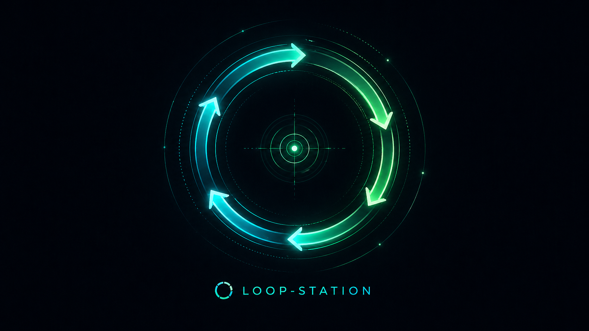

<p align="center">
  
</p>

# LOOP-STATION

**A reusable agent skill for running bounded improvement loops with evidence, review, and handoff.**

LOOP-STATION helps Codex, Claude Code, and other agents improve a target over multiple sessions without drifting from the original goal. It is not an optimizer by itself. It is the control layer around the work: it locks the frame, limits the loop, records evidence, coordinates review, and keeps implementation variants isolated until they are ready to promote.

## What the Skill Does

LOOP-STATION gives an agent a concrete operating protocol:

- **Locks the frame** before work starts: goal, budget, work-unit scope, collaboration mode, and user-intervention boundaries.
- **Runs bounded sessions** instead of open-ended retries.
- **Writes durable evidence** after each session: reports, changed values, artifacts, failures, and next proposals.
- **Coordinates reviewer handoff** so Codex, Claude Code, or another agent can review without asking the user to restate the goal.
- **Uses named flags** to show which agent is running, done, waiting for review, or finished.
- **Keeps code variants isolated** so loop-driven changes do not patch maintained source until the user explicitly promotes them.
- **Forces a decision point** at each session boundary: promote, keep, retire, continue, stop, or ask the user.

Use it when the work needs adaptive loops rather than one-shot execution:

- model or pipeline optimization
- data cleanup and quality repair
- code-quality or workflow refinement
- prompt and agent-behavior iteration
- visual and metric review loops
- multi-agent execution with reviewer handoff

## Why It Exists

Agent loops often fail in predictable ways:

- the goal changes between sessions
- reviewers lack enough context to judge the work
- evidence gets scattered across chat, logs, and local files
- retries continue without a budget or stop rule
- implementation variants overwrite maintained source before they are proven

LOOP-STATION turns those weak points into explicit files, flags, and decision rules.

## How to Command It

Invoke LOOP-STATION with a small required frame:

```text
Use $loop-station for this goal-directed loop.
Goal: ...
Budget: ...
Work-unit scope: ...
Collaboration: ...
User intervention: ...
```

Frame fields:

```text
Goal: what should improve or be decided
Budget: max sessions, wall time, resource pool, cost, or stop limit
Work-unit scope: one item, a fixed set, or a robustness set
Collaboration: supervisor only, executor + reviewer, or external review
User intervention: changes that require explicit approval
```

If any required field is missing, LOOP-STATION should ask only for the missing parts and keep asking until the frame is complete. Once the frame is locked, later agents reuse the same shared state instead of asking the setup questions again.

## How It Runs

The loop follows this rhythm:

```text
lock the frame
run a bounded session
write evidence and proposal
request named review when useful
wait within the review policy
write a decision
adapt, stop, or ask the user
```

Each loop keeps a shared folder inside the loop output root:

```text
loop_station/
  FRAME.md
  contract.json
  agent_roster.md
  sessions/
    session_001/
      executor_report.md
      executor_proposal.md
      decision.md
      reviewer_requests.md
      review_flags.md
  reviews/
    session_001/
      CLAUDE-SESSION001-REVIEWER-DONE.md
  flags/
    session_001/
      CODEX5.5-SESSION001-EXECUTOR-RUNNING.flag
      CODEX5.5-SESSION001-EXECUTOR-DONE.flag
      CLAUDE-SESSION001-REVIEWER-RUNNING.flag
      CLAUDE-SESSION001-REVIEWER-DONE.flag
```

If `contract.json` has `frame_locked: true`, later agents reuse the frame instead of asking for the goal, budget, scope, collaboration mode, or intervention boundaries again.

Flags use this naming pattern:

```text
{AGENT_NAME}-SESSION{NNN}-{ROLE}-{STATUS}
```

Examples:

```text
CODEX5.5-SESSION050-EXECUTOR-RUNNING
CODEX5.5-SESSION050-EXECUTOR-DONE
CLAUDE-SESSION050-REVIEWER-RUNNING
CLAUDE-SESSION050-REVIEWER-DONE
```

Reviewer waits are controlled by `review_wait_policy` in `contract.json`. The executor records review start, heartbeat, and completion timeouts, then proceeds only when the locked policy allows it.

## Safe Code Variants

Loop-driven implementation changes should not patch maintained source in place. Create an isolated implementation variant instead:

```text
{loop_output_root}/code_variants/session_003/quality_gate_adjustment/
  manifest.json
  decision.md
  src_or_scripts_to_run/
```

The manifest records copied source files, source hashes, changed files, the reason config-only changes were insufficient, and the command or config that runs the variant.

Direct edits to maintained source should require explicit user approval and a restore path.

## Install

### Codex

Install with Codex's skill installer:

```bash
python "${CODEX_HOME:-$HOME/.codex}/skills/.system/skill-installer/scripts/install-skill-from-github.py" --repo jjunsss/LOOP-STATION --path . --name loop-station
```

Restart Codex after installation so the new skill is loaded.

### Claude Code

Claude Code can use the same skill files. Add the repository contents to a Claude Code skill folder.

Personal skill:

```text
~/.claude/skills/
  loop-station/
    SKILL.md
    templates/
```

Project skill:

```text
<project>/
  .claude/
    skills/
      loop-station/
        SKILL.md
        templates/
```

Restart Claude Code after adding or updating the skill so it reloads the skill list.

### Manual Fallback

Use this only when an installer is not available.

Codex project-local fallback:

```text
<project>/
  skills/
    loop-station/
      SKILL.md
      agents/openai.yaml
      templates/
```

## Claude Code Reviewer Mode

For reviewer-only use, give Claude Code this prompt:

```text
Use LOOP-STATION in Reviewer / Project Review Mode.

Loop root:
<loop_output_root>/loop_station/

Agent name:
CLAUDE

If contract.json has frame_locked=true, do not ask me to restate the goal.
Read FRAME.md, contract.json, the latest executor_report.md, executor_proposal.md,
reviewer_requests.md, changed values, manifests, diffs, metrics, logs, and artifacts.

Do not run the next session.
Do not modify code.

Write only high-value review:
- whether the executor interpretation is supported by evidence
- whether changed values or implementation variants match the goal
- what to promote, keep, or retire
- risks or missing validation
- one recommended next action or ABSTAIN

Write:
<loop_output_root>/loop_station/reviews/session_{NNN}/CLAUDE-SESSION{NNN}-REVIEWER-DONE.md
<loop_output_root>/loop_station/flags/session_{NNN}/CLAUDE-SESSION{NNN}-REVIEWER-DONE.flag
```

## Example

See [`examples/quality-improvement-loop/`](examples/quality-improvement-loop/) for a generic quality-improvement loop frame and artifact layout.

## Notes

- LOOP-STATION is a protocol skill, not an optimizer by itself. The executor still needs project-specific commands, metrics, artifacts, and resource checks.
- Do not use it as an unbounded retry loop. A loop must have a budget and a stop or escalation path.
- Do not treat reviewer timeout as evidence that a result is good or bad. It is only a coordination event.
- Keep durable artifacts in the loop output root and keep temporary logs or generated data out of source control unless intentionally promoted.
- Add a license before publishing for external reuse.
